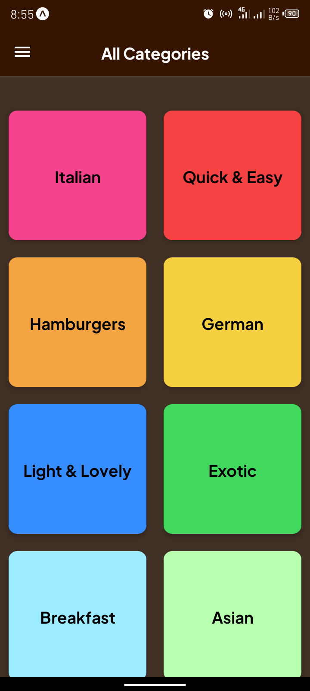
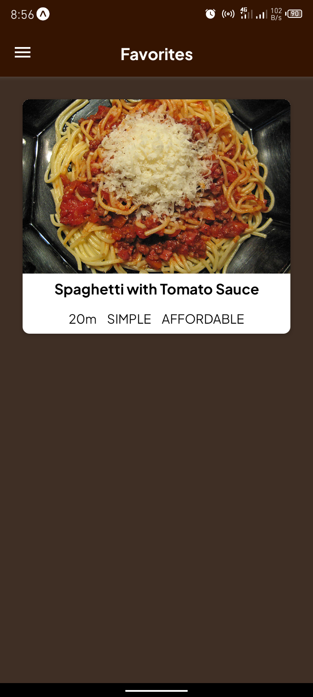

# Meals App

## About The App

This is a meals mobile app built with React Native. On the home screen, you can see a list of categories of meals to pick from. Each category has a list of meals that belong to it although some meals belong to more than one category. You can get more details about a particular meal (such as the ingredients and steps for preparation) when you click on a meal card. You alson have the ability to add a meal to your list of favorites which you can view from the menu on the home screen.

## Technologies Used

This project utilises React Navigation and context API for state management.

## Screenshots

